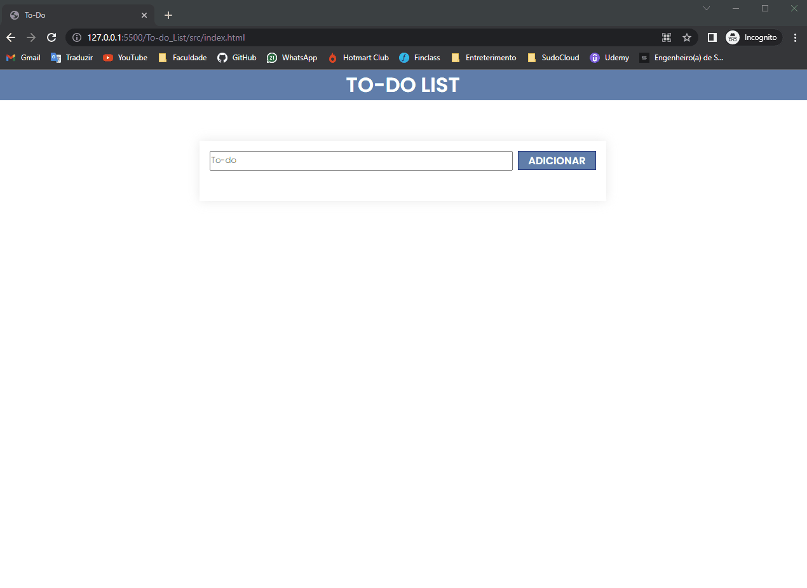
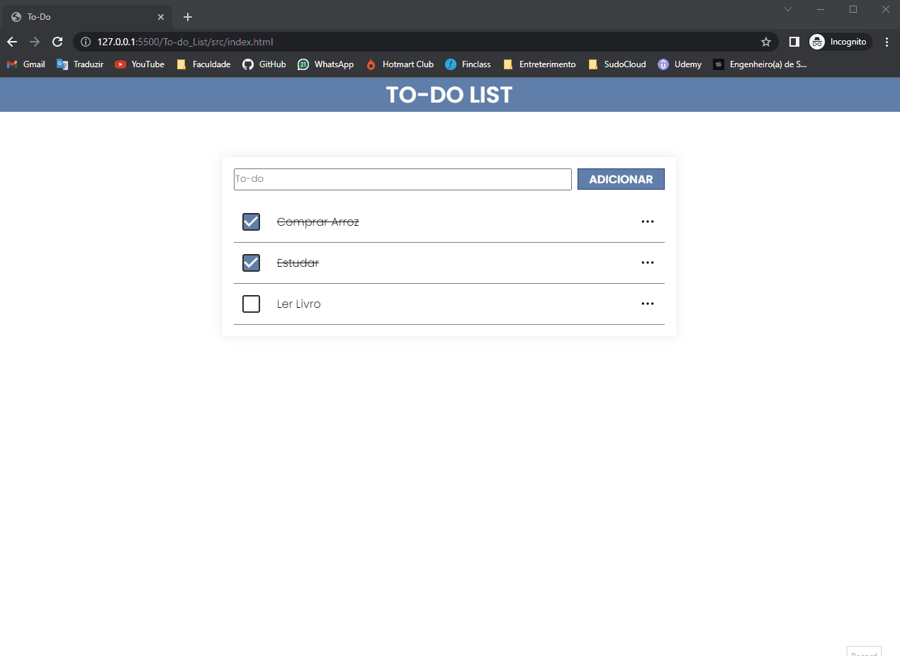
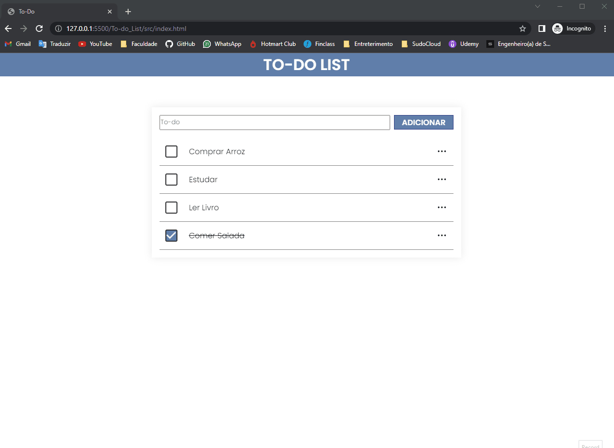

# To-do_List
 

Lista de Tarefas com dados persistentes utilizando localStorage HTML | CSS | JavaScript

Este projeto se trata de uma lista de tarefas com dados persistentes, onde você poderá adicionar, editar, excluir e marcar como feito seus afazeres sem perder seus dados ao fechar o navegador. Para a persistência de dados foi utilizado o localStorage do próprio navegador, permitindo que você fecha a aba ou o navegador, e mesmo assim suas tarefas continuarão salvas quando você voltar (Exceto se o localStorage seja limpo por meios externos). Sinta-se a vontade para Testar o projeto!! :)

<h2>Exibição Do Projeto</h2>

Neste gif você pode ver o objetivo principal deste projeto.

<h2>Persistência de Dados</h2>

Neste gif você pode ver o diferencial deste projeto, que é a persistência de Dados, que permite que a aba ou navegador seja fechado, e quando for reaberto estará da mesma forma. O localStorage seria uma abstração de um Banco de Dados

<h2>Funcionalidades</h2>

Neste gif você pode ver as funcionalidades disponíveis que é a edição e exclusão da tarefa em foco.

<h3>Tecnologias</h3>
*HTML
*CSS
*JavaScript
 

<b>Sinta-se a vontade para testar! :)</b>Clique aqui para ir ao <a href="https://www.linkedin.com/in/vin%C3%ADcius-gonzaga-guilherme-9a65a722a/">Meu LinkedIn</a>

